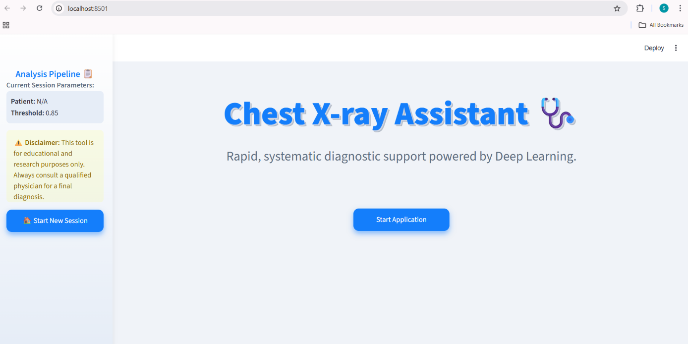
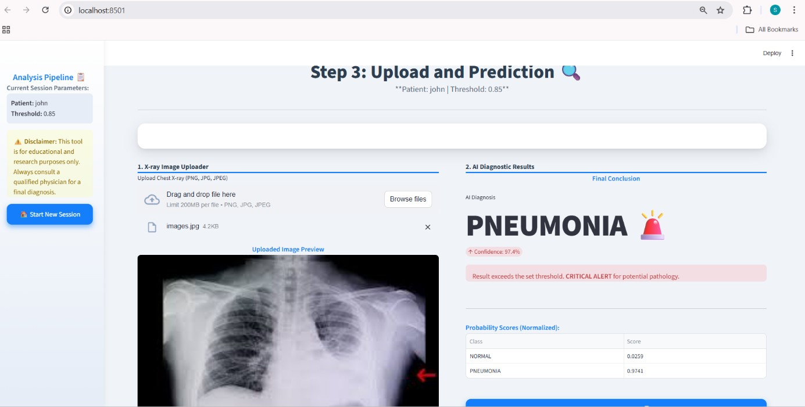
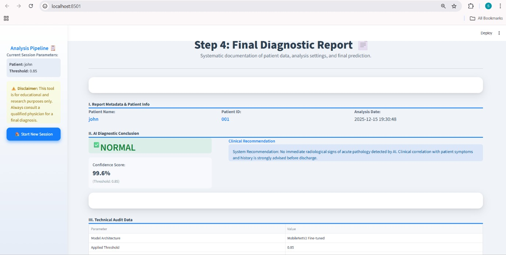
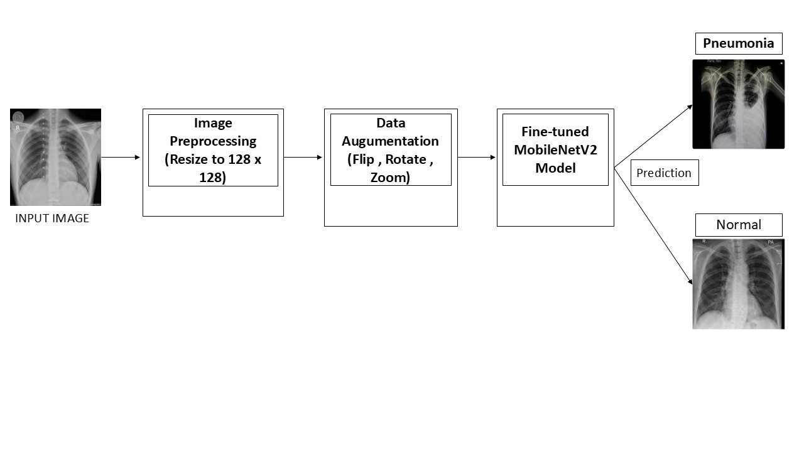

# 🩺 Pneumonia Detection AI  
### Chest X-ray Diagnosis using CNN & Transfer Learning (MobileNetV2)

> **An intelligent AI-based system to detect Pneumonia from Chest X-ray images with high recall and clinical accuracy.**

---

## 🚀 Why this Project?

Pneumonia is a serious lung infection that can be life-threatening if not detected early.  
Manual analysis of Chest X-rays is time-consuming and depends heavily on expert availability.

This project uses **Deep Learning + Transfer Learning** to provide:
- **Fast**
- **Consistent**
- **High-recall**
diagnosis support.

---

## 🎯 What Does the System Do?

✔ Accepts Chest X-ray image  
✔ Preprocesses and resizes image to 128×128  
✔ Passes image through trained CNN model  
✔ Predicts **NORMAL** or **PNEUMONIA**  
✔ Displays **confidence score**  
✔ Generates **final diagnostic report**

All inside a **professional Streamlit web application**.

---

## 🧠 AI Model – Technical Overview

- **Architecture:** MobileNetV2 (Transfer Learning)  
- **Input Size:** 128 × 128 RGB  
- **Classes:** Normal / Pneumonia  
- **Framework:** TensorFlow + Keras  
- **Loss Function:** Binary Cross Entropy  
- **Optimizer:** Adam  
- **Techniques Used:**
  - Data Augmentation  
  - Class Weighting  
  - Dropout Regularization  
  - Fine-tuning  

---

## 📈 Model Performance (Final Results)

| Metric        | Score  |
|---------------|--------|
| **Accuracy**  | 89.10% |
| **Precision** | 87.27% |
| **Recall**    | 96.67% |
| **F1-Score**  | 91.73% |
| **Loss**      | 1.1276 |

> ⚡ **High Recall (96.67%) is critical in medical diagnosis** – it ensures that most pneumonia cases are correctly detected, minimizing false negatives.

---

## 🗂️ Project Structure

```

Final Year Project/
│
├── app.py
├── pneumonia_model.keras
├── images/
├── screenshots/
├── Test Images/
├── README.md
└── requirements.txt

````

---

## 🖼️ Application Screenshots

### 🚀 Splash Screen


### 🏠 Home – Deep Learning Platform


### 👤 Patient Details Entry


### ⚙️ Analysis Configuration


### 📤 Upload & Prediction – NORMAL


### 📤 Upload & Prediction – PNEUMONIA


### 📄 Final Report – NORMAL


### 📄 Final Report – PNEUMONIA


---

## 📊 Accuracy & Loss Curve


---

## 🧩 System Architecture


---

## ⚙️ Model Training (Backend)

The model was trained on Kaggle using GPU for high performance.

🔗 **Kaggle Training Notebook:**  
https://www.kaggle.com/code/sachithc/pneumonia-model-keras

---

## ▶ How to Run the Project

```bash
pip install -r requirements.txt
streamlit run app.py
````

Open browser → **[http://localhost:8501](http://localhost:8501)**

---

## ⚠️ Disclaimer

> This system is developed **only for educational and research purposes**.
> It is **not a replacement for professional medical diagnosis**.

---

## 👨‍🎓 Team

* **Sachith.C** – 1CD22IS147
* **Amith.N.K** – 1CD22IS014
* **Sanjay.M.P** – 1CD23IS412
* **Yathish T.S** – 1CD22IS190

Department of Information Science & Engineering
Cambridge Institute of Technology, Bengaluru

---

## 👩‍🏫 Project Guide

**Asst. Prof. Kavya V R**
Department of ISE, CiTech, Bengaluru

---


